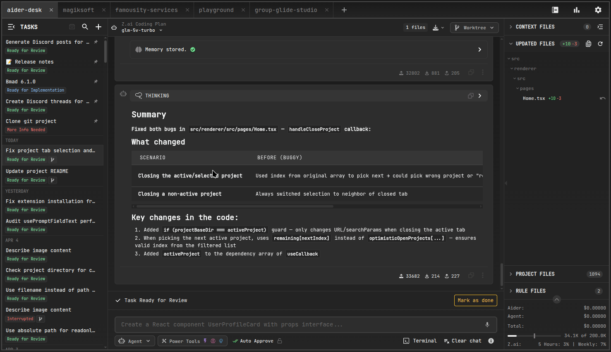
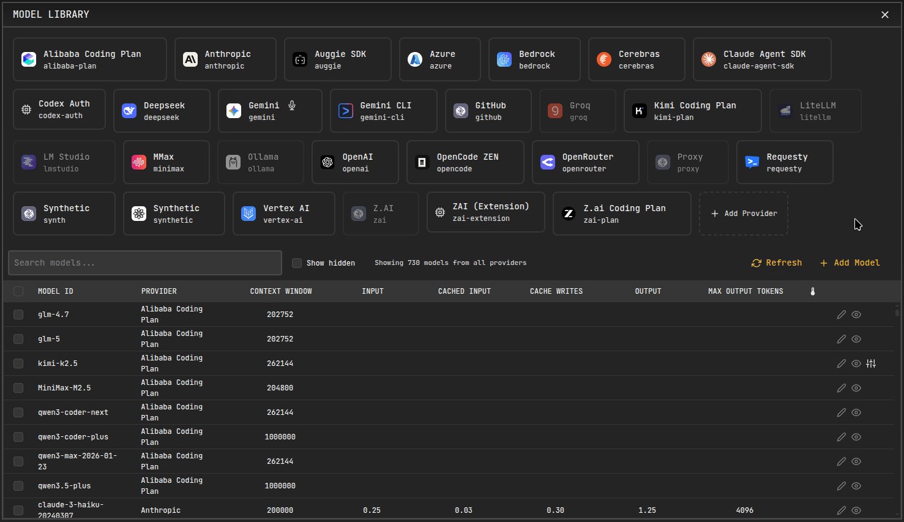
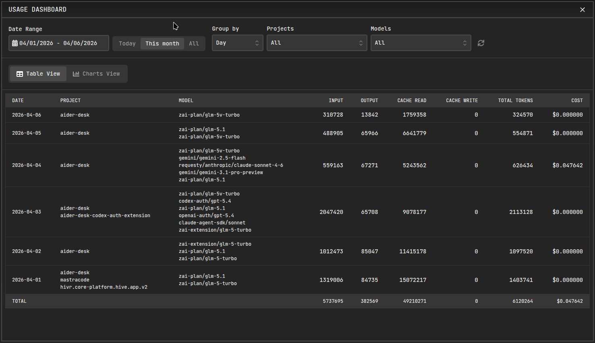
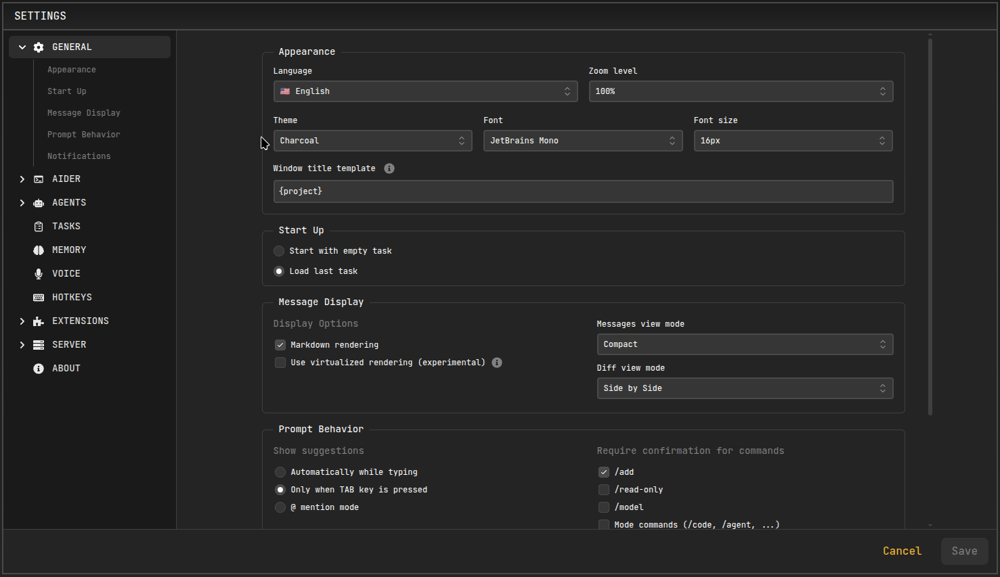
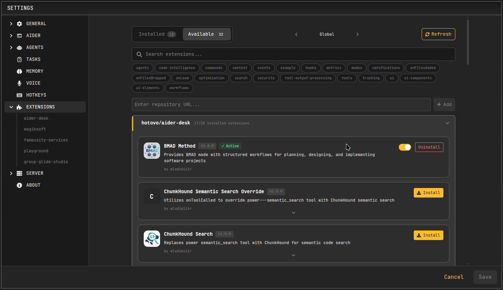
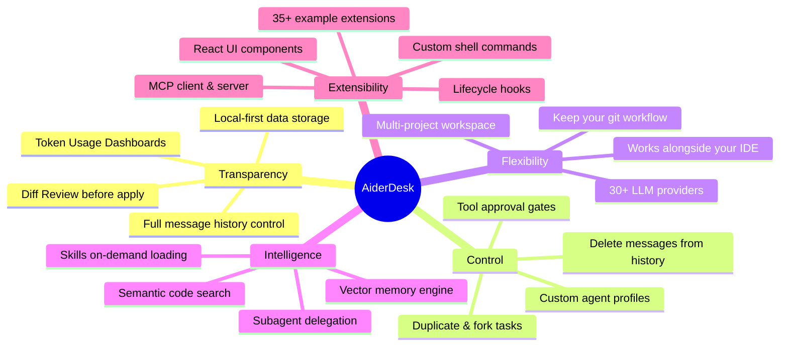

<p align="center">
  
</p>
<h1 align="center">AiderDesk</h1>
<p align="center">
  <strong>Transparent, Steerable AI Orchestration for Professional Software Engineers.</strong>
</p>

<p align="center">
  <a href="https://aiderdesk.hotovo.com/docs"></a>
  <a href="https://discord.com/invite/dyM3G9nTe4"></a>
  <a href="https://deepwiki.com/hotovo/aider-desk"></a>
  <a href="https://gitmcp.io/hotovo/aider-desk"></a>
</p>

<blockquote>
<p align="center">
  🤖 Not just a GUI for Aider — a complete orchestration layer.<br/>
  Steer AI behavior, review every change, isolate experiments, and extend everything.<br/>
  Your workflow. Your rules. Your codebase stays intact.
</p>
</blockquote>

---

## 🔭 Overview

AiderDesk is an open-source agentic platform that puts **you** back in the driver's seat of AI-assisted development.

Originally created as a graphical user interface for the powerful [Aider CLI](https://github.com/paul-gauthier/aider), it has evolved into a comprehensive orchestration layer — built for seasoned professionals who refuse to trade control for convenience.

**Three principles guide everything we build:**


| 🫧 Transparency                                                                                              | 🎛️ Control                                                                                                                                                              | 🤝 Flexibility                                                                                                                                 |
| ------------------------------------------------------------------------------------------------------------ | ------------------------------------------------------------------------------------------------------------------------------------------------------------------------- | ---------------------------------------------------------------------------------------------------------------------------------------------- |
| See every token, every context file, and every proposed change before it lands. Nothing happens in the dark. | The AI is a junior pair programmer, not an autopilot. Approve tools, authorize destructive actions, fork tasks, and surgically edit chat history to keep things on track. | Keep your IDE. Keep your terminal. Keep your Git workflow. AiderDesk slides in alongside your existing toolchain — no disruption, no lock-in. |

---

## 📥 Installation

1. Download the latest release for your OS from [Releases](https://github.com/hotovo/aider-desk/releases).
2. Run the executable.

For additional installation options (npm, Docker, Homebrew, Scoop), see the [installation guide](https://aiderdesk.hotovo.com/docs).

---

## ✨ Key Features

- 📂 **Project & Task Management:** Manage multiple codebases simultaneously without losing your train of thought. AiderDesk organizes your environment into Projects (repositories) and breaks them down into individual Tasks (features/bugs). Switch between entirely different repositories and isolated workflows instantly from a unified dashboard.
- 🌳 **Git Worktrees:** Use isolated Git worktrees to work on multiple tasks simultaneously. Each task gets its own directory where the AI can experiment, refactor, and build without ever touching or breaking your active local branch. When ready, review the diffs and merge the worktree branch back into your main flow through AiderDesk's built-in merge workflow.
- 🔄 **Advanced Task & History Control:** Never let your AI get stuck in a bad context loop. Seamlessly **duplicate or fork tasks** to explore alternative implementation paths safely. Precisely curate the AI's memory by **deleting specific messages** from the chat history, ensuring the context window remains clean, relevant, and free of hallucinations.
- 🧠 **Smart Context & Memory Engine:** Powered by vector embeddings (LanceDB) and intelligent repository mapping, AiderDesk ensures the AI only loads the exact files it needs. Rely on semantic search across your codebase or explicitly pin documentation URLs and code symbols to force the AI's focus.
- 🔍 **Rich Review & Approval Gates:** Review every proposed change before it hits your disk. AiderDesk features a rich, compact diff viewer (side-by-side and unified modes) for line-by-line inspection. Configure strict tool approval gates requiring human authorization before the AI can execute shell commands or file operations.
- 🤖 **Subagents & Multi-Model Orchestration:** Delegate complex, multi-step problems to specialized subagents. Define Agent Profiles (e.g., "Strict Refactor Agent", "UI/UX Expert") with custom system prompts and boundaries. Seamlessly switch between OpenAI, Anthropic, Gemini, DeepSeek, Ollama, and 25+ other providers.

---

## 🧩 Extensibility: Make It Yours

AiderDesk is built to be deeply extended. We know that every enterprise and senior engineer has unique toolchains, build scripts, and workflows. The modular extension architecture allows you to inject custom logic directly into the AI's runtime and the platform's UI.

### Extensions

AiderDesk extensions go far beyond simple prompt tweaks. You can:

- **Hook into the Lifecycle:** Enforce project-specific linting or formatting by intercepting core events (`onTaskCreated`, `onPromptFinished`, `onToolCalled`, `onFileAdded`, and 30+ more).
- **Provide Custom Tools:** Write TypeScript functions (e.g., triggering an internal CI/CD pipeline) and expose them directly to the AI as callable tools.
- **Inject React Components:** Build custom UI widgets, sidebar panels, or inline live-preview renderers directly into the chat interface.

Browse [extension gallery](https://aiderdesk.hotovo.com/docs/extensions/extensions-gallery) or install via CLI:

```bash
npx @aiderdesk/extensions install
```

### Model Context Protocol (MCP)

Bring your own data. Connect AiderDesk to any standard MCP server to give your AI assistants secure, scoped access to external databases, enterprise APIs (Jira, Linear), or internal wikis. AiderDesk can also [expose itself as an MCP server](https://aiderdesk.hotovo.com/docs/features/aider-mcp-server) to other MCP-compatible clients like Claude Desktop or Cursor.

### Custom Commands & Skills

Inject your project-specific shell commands, linters, and test suites directly into the AI's toolkit, allowing it to autonomously verify its own work. Package reusable expertise into [Skills](https://aiderdesk.hotovo.com/docs/features/skills) that load on-demand with progressive disclosure — keeping token usage lean while giving the AI domain-specific knowledge when needed.

---

## 🛠️ Additional Capabilities

- **Integrated Terminal:** Run commands and view outputs directly within your task's isolated environment without leaving the app.
- **Cost & Usage Analytics:** Detailed, real-time dashboards tracking token consumption, model usage distribution, and cost breakdowns to prevent billing surprises.
- **Voice Control:** Native support for voice interactions using top-tier voice models for hands-free orchestration.
- **Local Data Privacy:** All chat history, task metadata, and settings are stored locally on your machine using a lightweight, fast local database — keeping your workspace data private and offline.
- **Customizable Aesthetics:** Built with React 19 and Tailwind CSS, featuring multiple beautiful dark and light themes.
- **REST API:** Integrate AiderDesk with external tools and workflows via a comprehensive REST API.
- **IDE Connector Plugins:** Sync context files automatically from [IntelliJ IDEA](https://plugins.jetbrains.com/plugin/26313-aiderdesk-connector) or [VS Code](https://marketplace.visualstudio.com/items?itemName=hotovo-sk.aider-desk-connector).

> For the full list of capabilities, visit our [Documentation](https://aiderdesk.hotovo.com/docs).

---

## 📸 Screenshots

<table>
  <tr>
    <td width="50%" align="center"><br/>Git Worktrees</td>
    <td width="50%" align="center"><br/>Advanced Task Management</td>
  </tr>
  <tr>
    <td width="50%" align="center"><br/>Model Library</td>
    <td width="50%" align="center"><br/>Usage Dashboard</td>
  </tr>
  <tr>
    <td width="50%" align="center"><br/>Settings</td>
    <td width="50%" align="center"><br/>Extensions</td>
  </tr>
</table>

---

## 🗺️ Feature Map



---

## 🤝 Contributing

We welcome contributions from engineers who share our vision of transparent, steerable AI! Whether it's a bug fix, a new Extension, or a core feature enhancement, please check out our Contributing Guidelines to get started.

---

## ⭐ Star History

[](https://star-history.com/#hotovo/aider-desk&Date)

Thank you ❤️

---

## 📄 License

AiderDesk is released under the MIT License.
