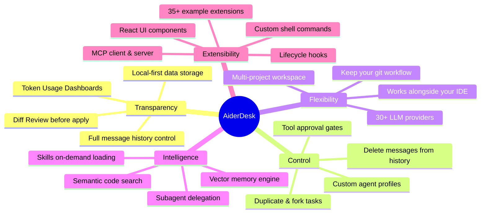

<div align="center">
<!-- TODO: Add a high-quality logo or banner image here -->
<h1>AiderDesk</h1>
<p><b>Transparent, Steerable AI Orchestration for Professional Software Engineers.</b></p>

[](https://aiderdesk.hotovo.com/docs)
[](https://discord.com/invite/dyM3G9nTe4)
[](https://deepwiki.com/hotovo/aider-desk)
[](https://gitmcp.io/hotovo/aider-desk)
</div>

## 🧭 Overview

AiderDesk is an open-source agentic platform designed to give software engineers complete control over AI-assisted development.

Originally created as a graphical user interface for the powerful Aider CLI, AiderDesk has evolved into a comprehensive orchestration layer. It is built for seasoned professionals who need to steer AI behaviors, maintain strict visibility into codebase changes, and seamlessly integrate AI into their established, pre-existing workflows without disruption.

## ✨ Core Philosophy

- **Absolute Transparency:** You should always know exactly what context the AI is using, how many tokens it consumes, and what changes it intends to make. Every action is reviewable.
- **Control & Steerability:** AI is a junior pair programmer, not an autopilot. AiderDesk gives you the levers to approve tool usage, explicitly authorize destructive actions, and surgically manipulate task history to keep the AI on track.
- **Workflow Flexibility:** We don't dictate how you work. Keep your favorite IDE, your terminal, and your Git practices. AiderDesk sits alongside your existing toolchain to enhance it.

## 🚀 Hero Features

### 📂 Multi-Project Workspaces & Task Management

Manage multiple codebases simultaneously without losing your train of thought. AiderDesk organizes your environment into Projects (repositories) and breaks them down into individual Tasks (features/bugs). Switch between entirely different repositories and isolated workflows instantly from a unified dashboard.

### 🌳 Git-Native Task Isolation (Worktrees)

AiderDesk automatically provisions isolated Git worktrees for every Task. This allows the AI to experiment, refactor, and build in its own dedicated directory without ever touching or breaking your active local branch. Once a task is complete, review the diffs and seamlessly merge the worktree branch back into your main flow.

### 🔄 Advanced Task & History Control

Never let your AI get stuck in a bad context loop. AiderDesk allows you to seamlessly **duplicate or fork tasks** to explore alternative implementation paths safely. You can also precisely curate the AI's memory by **deleting specific messages** from the chat history, ensuring the context window remains clean, relevant, and free of hallucinations.

### 🧠 Smart Context & Memory Engine

Powered by vector embeddings (LanceDB) and intelligent repository mapping, AiderDesk ensures the AI only loads the exact files it needs. You can rely on semantic search across your codebase or explicitly pin documentation URLs and code symbols to force the AI's focus.

### 🔍 Rich Review & Approval Gates

Review every proposed change before it hits your disk. AiderDesk features a rich, compact diff viewer (side-by-side and unified modes) for line-by-line inspection. Configure strict tool approval gates requiring human authorization before the AI can execute shell commands or file operations.

### 🤖 Subagents & Multi-Model Orchestration

Delegate complex, multi-step problems to specialized subagents. Define Agent Profiles (e.g., "Strict Refactor Agent", "UI/UX Expert") with custom system prompts and boundaries. Seamlessly switch between OpenAI, Anthropic, Gemini, DeepSeek, Ollama, and 25+ other providers.

## 🧩 Infinite Extensibility: Make It Yours

AiderDesk is built to be deeply extended. We know that every enterprise and senior engineer has unique toolchains, build scripts, and workflows. The modular extension architecture allows you to inject custom logic directly into the AI's runtime and the platform's UI.

### 1. Model Context Protocol (MCP)

Bring your own data. Connect AiderDesk to any standard MCP server to give your AI assistants secure, scoped access to external databases, enterprise APIs (Jira, Linear), or internal wikis. AiderDesk can also [expose itself as an MCP server](https://aiderdesk.hotovo.com/docs/features/mcp-server) to other MCP-compatible clients like Claude Desktop or Cursor.

### 2. Deep UI & Logic Extensions

AiderDesk extensions go far beyond simple prompt tweaks. You can:

- **Inject React Components:** Build custom UI widgets, sidebar panels, or inline live-preview renderers directly into the chat interface.
- **Provide Custom Tools:** Write TypeScript functions (e.g., triggering an internal CI/CD pipeline) and expose them directly to the AI as callable tools.
- **Hook into the Lifecycle:** Enforce project-specific linting or formatting by intercepting core events (`onTaskCreated`, `onPromptFinished`, `onToolCalled`, `onFileAdded`, and 30+ more).

Browse [extension examples](https://aiderdesk.hotovo.com/docs/extensions/examples) or install via CLI:

```bash
npx @aiderdesk/extensions install
```

### 3. Custom Shell Commands & Skills

Inject your project-specific shell commands, linters, and test suites directly into the AI's toolkit, allowing it to autonomously verify its own work. Package reusable expertise into [Skills](https://aiderdesk.hotovo.com/docs/features/skills) that load on-demand with progressive disclosure — keeping token usage lean while giving the AI domain-specific knowledge when needed.

## 🛠️ Additional Capabilities

- **Integrated Terminal:** Run commands and view outputs directly within your task's isolated environment without leaving the app.
- **Cost & Usage Analytics:** Detailed, real-time dashboards tracking token consumption, model usage distribution, and cost breakdowns to prevent billing surprises.
- **Voice Control:** Native support for voice interactions using top-tier voice models for hands-free orchestration.
- **Local Data Privacy:** All chat history, task metadata, and settings are stored locally on your machine using a lightweight, fast local database — keeping your workspace data private and offline.
- **Customizable Aesthetics:** Built with React 19 and Tailwind CSS, featuring multiple beautiful dark and light themes.
- **REST API:** Integrate AiderDesk with external tools and workflows via a comprehensive REST API.
- **IDE Connector Plugins:** Sync context files automatically from [IntelliJ IDEA](https://plugins.jetbrains.com/plugin/26313-aiderdesk-connector) or [VS Code](https://marketplace.visualstudio.com/items?itemName=hotovo-sk.aider-desk-connector).

## 📦 Getting Started

### Prerequisites

- Node.js (v18 or higher) & npm
- Python environment (we highly recommend using `uv`)
- The `aider-chat` CLI installed in your Python environment

### Installation

1. **Clone the repository:**

   ```bash
   git clone https://github.com/hotovo/aider-desk.git
   cd aider-desk
   ```

2. **Install frontend/backend dependencies:**

   ```bash
   npm install
   ```

3. **Start the development server:**

   ```bash
   npm run dev
   ```

For detailed instructions on configuring API keys, local models, and production builds, please refer to our [Documentation](https://aiderdesk.hotovo.com/docs).

## 🤝 Contributing

We welcome contributions from engineers who share our vision of transparent, steerable AI! Whether it's a bug fix, a new Extension, or a core feature enhancement, please check out our Contributing Guidelines to get started.

## ⭐ Star History

[](https://star-history.com/#hotovo/aider-desk&Date)

## 🗺️ Feature Map



## 📄 License

AiderDesk is released under the MIT License.
