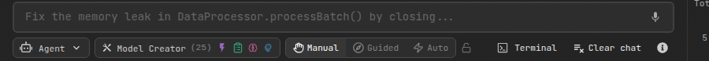

# Agent Mode

**Agent Mode is the default way of working in AiderDesk.** Every new task runs with the agent out of the box — it plans, uses tools, and executes work autonomously while you stay in control through approval gates. Classic aider modes (`/code`, `/ask`, `/architect`) remain one click away in the mode selector whenever you want them.

Powered by the Vercel AI SDK, the agent can handle complex software engineering tasks end to end.

## Key Capabilities

- **Autonomous Task Execution**: The agent breaks a high-level request (e.g. *"refactor the authentication logic"*) into concrete steps and works through them.
- **Tool Utilization**: Built-in [Power Tools](power-tools.md) for file system operations, [Aider Tools](aider-tools.md) for code manipulation, external tools via [MCP Servers](mcp-servers.md), plus [task tools](task-tools.md) that let it organize work into tasks and subtasks.
- **Extensible to Any Workflow**: [Extensions](../extensions/index.md) can add custom tools, commands, modes, agent profiles, and UI — or just ask the agent (it ships with an Extension Creator skill).
- **Configurable Profiles**: Tailor behavior, permissions, and model settings per workflow with [Agent Profiles](agent-profiles.md) and [Subagents](subagents.md).
- **Transparent Operation**: Watch the agent's reasoning, tool calls, and results directly in the chat.
- **Self-Managing Context**: With [smart auto-compaction](../core/handoff-and-compaction.md), long-running agents keep their own context healthy.

## Autonomy Modes

The **Autonomy Selector** in the prompt field controls how much freedom the agent has:

### Manual

Every tool execution and plan requires your explicit approval before proceeding.

**Best for:** Unfamiliar codebases, risky operations, or full oversight of every step.

### Guided *(default)*

The agent plans first and presents its plan for approval; executions within the approved plan are auto-approved.

**Best for:** Everyday development — you steer direction while the agent handles the details.

### Autonomous

The agent plans and executes without interruption until the task completes.

**Best for:** Trusted, well-understood tasks where you want to step away.

### Locking the Autonomy Mode

New tasks start in Guided mode by default. Clicking the lock icon next to the selector saves its locked/unlocked state as a project-level setting.

## In This Section

- [How to Use Agent Mode](how-to-use.md)
- [Managing Tasks](managing-tasks.md) — the task system the agent lives in
- [AGENTS.md (/init)](init.md) — project rules the agent follows
