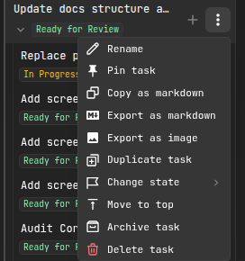
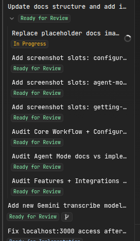

# Managing Tasks

Every conversation in AiderDesk lives inside a **task**. Tasks persist all messages, context files, todos, and costs — close the app, come back tomorrow, and pick up exactly where you left off.

## Task Sidebar

The **Task Sidebar** on the left lists all tasks of a project:

- Sorted by last update, with live status indicators while the agent works
- **Search**, bulk multiselect, pin, archive, and duplicate actions
- Drag and drop to **reorder tasks and subtasks**
- Resizable — and collapsible when you need the room



## Task Operations

| Operation | How |
| --- | --- |
| **Create** | `New Task` button, or just send a prompt |
| **Rename** | Double-click the name (or let smart naming generate one) |
| **Duplicate** | Full copy including messages, context, todos, and cost data — great as a template or for exploring an alternative approach |
| **Fork** | Start a new task from any past message in a conversation, carrying over the context up to that point |
| **Archive** | Hide completed work without deleting it |
| **Pin** | Keep important tasks at the top |
| **Export** | Save the conversation as Markdown or PNG |
| **Delete** | With confirmation — deleting a parent deletes its subtasks |

## Subtasks

Subtasks break complex work into a hierarchy:

```
User Authentication
├── Login Form
│   └── Validation Edge Cases
├── Registration Form
└── Password Reset
```

- Create via the hover action on any task, or let the agent spawn them with its [task tools](task-tools.md)
- **Nest arbitrarily deep** — subtasks can have their own subtasks
- Each subtask has independent context, todos, and cost tracking
- Subtasks automatically inherit the parent's worktree environment



## Smart Task States

With *Smart Task State* enabled (Settings → Tasks), the AI analyzes each task after every prompt and suggests one of three states: **More Info Needed**, **Ready for Implementation**, or **Ready for Review**. Lifecycle states like *To Do*, *In Progress*, *Interrupted*, or *Done* are tracked automatically as work happens — so you can triage your backlog at a glance.

You can also configure dedicated models for task naming and state analysis in [Task settings](../configuration/settings.md).

## Cost Tracking

Each task independently tracks token usage and costs for both aider and agent interactions, updated in real time. Compare approaches by duplicating a task and running each variant once.

## Related

- [Git Worktrees](../features/git-worktrees.md) — isolate task work on separate branches
- [Handoff & Compaction](../core/handoff-and-compaction.md) — move focused context into new tasks
- [Task Tools](task-tools.md) — how agents create and manage tasks themselves
- [Usage Dashboard](../features/usage-dashboard.md) — aggregate cost analytics across projects
