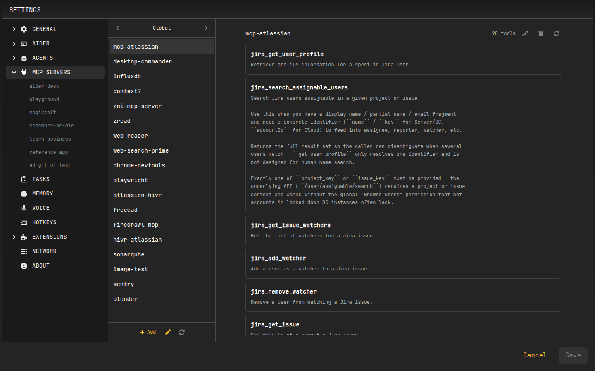

# MCP Servers

AiderDesk's Agent Mode can be extended with external tools through the **Model Context Protocol (MCP)**. By connecting to MCP servers, you can grant the agent new capabilities, such as web browsing, accessing documentation, or interacting with custom internal services.

## What is MCP?

The [Model Context Protocol](https://modelcontextprotocol.io/) is an open standard that allows AI models to safely and effectively use external tools. An MCP server exposes a set of tools that an AI agent can call to perform actions or retrieve information.

## Configuring MCP Servers

You can manage your MCP servers in the dedicated **MCP Servers** tab in **Settings**.



### Adding a New Server

1.  Open **Settings** and navigate to the **MCP Servers** tab.
2.  Use the context switcher in the top-left corner to select where the server should live: **Global** (applies to all projects) or an open project (project-scoped server).
3.  Click the **Add** button.
4.  A form will appear where you can paste your server configuration as JSON.
5.  Use the context switcher or select a server in the list to view its tools. Each entry offers **Reload**, **Edit**, and **Remove** actions.

You can also edit the entire server configuration of the current context in raw JSON (pencil icon) or reload all servers at once (refresh icon).

### Configuration Storage

MCP server configurations are stored in **JSON files** on disk rather than in the application settings:

- **Global servers** — stored in `mcp-servers.json` inside the AiderDesk home directory (default: `~/.aider-desk/mcp-servers.json`, configurable via `AIDER_DESK_HOME_DIR`).
- **Project servers** — stored in `<projectDir>/.aider-desk/mcp-servers.json`.

The file format is:

```json
{
  "mcpServers": {
    "server-name": {
      "command": "npx",
      "args": ["-y", "@modelcontextprotocol/server-puppeteer"]
    }
  }
}
```

Global servers are available to every project, while project servers are scoped to their project and take precedence over global servers with the same name (the two are merged). The files are watched, so any changes made externally (for example, editing the file directly or committing one to the repository) are picked up automatically.

### Configuration Format

The configuration is a JSON object that specifies how to run the MCP server. AiderDesk will start and manage the server process for you.

The configuration requires a `command` and an array of `args`. You can also provide environment variables in an `env` object.

For streamable http servers, you can also specify `url` and `headers`.

**Example: Adding a streamable http server**
```json
{
  "mcpServers": {
    "http-server": {
      "url": "http://localhost:8000/mcp",
      "headers": {
        "x-api-key": "super-secret-key"
      }
    }
  }
}
```

**Example: Adding a Puppeteer server for web browsing**
```json
{
  "mcpServers": {
    "puppeteer": {
      "command": "npx",
      "args": [
        "-y",
        "@modelcontextprotocol/server-puppeteer"
      ]
    }
  }
}
```

You can also paste a "bare" configuration without the `mcpServers` wrapper.

### Using Directory Placeholders in Configuration

You can use placeholders in your server's `args` or `env` configuration:

- `${projectDir}` - Replaced with the absolute path to the project's root directory
- `${taskDir}` - Replaced with the absolute path to the current task's working directory:
  - When using worktree mode: points to the worktree directory
  - When using local mode: points to the project root directory (same as `${projectDir}`)

**Example using projectDir:**
```json
{
  "mcpServers": {
    "my-custom-tool": {
      "command": "node",
      "args": [
        "/path/to/my/tool.js",
        "--project-root",
        "${projectDir}"
      ]
    }
  }
}
```

**Example using taskDir (works with both worktree and local modes):**
```json
{
  "mcpServers": {
    "file-operations": {
      "command": "node",
      "args": [
        "/path/to/file-tool.js",
        "--working-dir",
        "${taskDir}"
      ]
    }
  }
}
```

**Important:** The MCP server's working directory (`cwd`) is automatically set to `${taskDir}`, so tools that operate on files will work in the task's working directory by default. Use `${projectDir}` when you need to access the project root regardless of whether worktree mode is active.

## Enabling Servers and Tools in Agent Profiles

Configuring a server only defines its configuration — you must also enable it within a specific **Agent Profile** to make its tools available to the agent.

1.  In the **Agent** settings tab, select the profile you wish to edit.
2.  In the profile's tools section, you will see a list of all configured servers (global and project servers merged for the current project).
3.  Use the checkbox next to each server name to enable or disable it for the selected profile.
4.  You can further refine tool access by expanding a server's entry and setting the approval state for each individual tool (`Always`, `Never`, `Ask`).

## Authorization for Remote MCP Servers

AiderDesk supports **OAuth authorization** for remote MCP servers that require it (e.g., Sentry).

### Authorize a Server

1.  Open **Settings** and navigate to the **MCP Servers** tab.
2.  Select the server that requires authentication.
3.  Click **Connect** — the authorization flow opens in your browser. Once you complete it, the connection is stored and the server's tools become available.

If your server requires an authorization flow that the built-in OAuth support does not cover, you can fall back to [mcp-remote](https://github.com/geelen/mcp-remote) as a stdio-based proxy.

### Step 1: Authorize in Your Terminal

Run `mcp-remote` in your terminal and complete the authorization flow:

```bash
npx mcp-remote https://mcp.sentry.dev/mcp
```

### Step 2: Configure AiderDesk

Use `mcp-remote` as a stdio-based proxy in your MCP server configuration instead of connecting directly:

```json
{
  "mcpServers": {
    "sentry": {
      "command": "npx",
      "args": [
        "mcp-remote",
        "https://mcp.sentry.dev/mcp"
      ]
    }
  }
}
```
