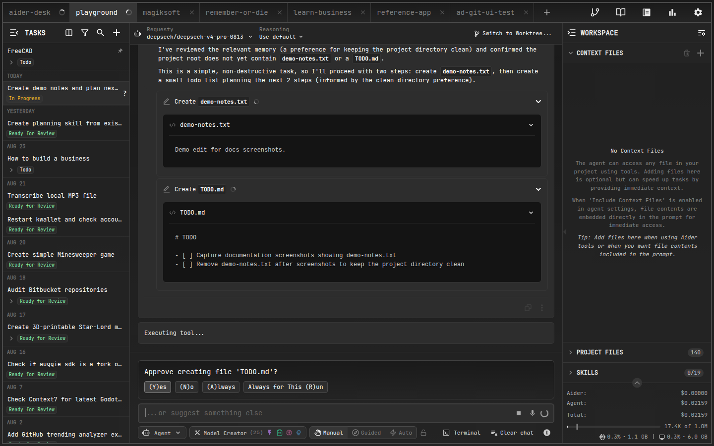

# Power Tools

## What Are Power Tools?

Power tools are a collection of specialized AI tools that provide direct file system interaction and development operations within AiderDesk. They give the AI agent granular control over your project files and environment, enabling more efficient and targeted operations. Power tools complement AiderDesk's existing Aider integration by providing:

- **Direct file operations** - Read, write, and edit files without full Aider context management
- **Advanced search capabilities** - Semantic search, pattern matching, and content discovery
- **System integration** - Execute shell commands and fetch web content
- **Performance optimization** - Faster operations for simple file tasks

Unlike Aider tools that manage the full codebase context, power tools offer immediate, targeted operations that are perfect for quick file modifications, content searches, and system interactions.

## Getting Started

### Enabling Power Tools

1. Open AiderDesk Settings
2. Navigate to the **Agent** section
3. Toggle **"Use Power Tools"** to enable the feature
4. Configure individual tool approval settings as needed

### Basic Usage

Once enabled, power tools are automatically available to the AI agent. You can:

- Ask the agent to search for specific code patterns
- Request file modifications or new file creation
- Have the agent execute system commands (with approval)
- Fetch documentation or web pages for reference

## Available Power Tools

### File Operations

#### `power---file_read`
Reads and displays the content of any text file in your project.

**Use cases:**
- Inspecting configuration files
- Reviewing code before modifications
- Understanding file structure and content

**Example request:**
> "Read the package.json file to see what dependencies are installed"

#### `power---file_write`
Creates new files or modifies existing ones with three modes:
- **overwrite** - Replaces entire file content (default)
- **append** - Adds content to the end of the file
- **create_only** - Creates file only if it doesn't exist

**Use cases:**
- Creating new components or modules
- Adding configuration files
- Appending to log files or documentation

**Example request:**
> "Create a new React component called UserProfile in src/components/"

#### `power---file_edit`
Makes targeted changes to files by finding and replacing specific content.

**Features:**
- String or regex pattern matching
- Replace first occurrence or all occurrences
- Atomic operations (all-or-nothing changes)

**Use cases:**
- Updating function names across files
- Modifying configuration values
- Refactoring code patterns

**Example request:**
> "Replace all instances of 'oldFunctionName' with 'newFunctionName' in the utils.ts file"

### Search and Discovery

#### `power---semantic_search`
Performs intelligent code search using natural language queries.

**Features:**
- Elasticsearch-like query syntax
- Language-specific filtering
- Configurable result limits
- Test file inclusion/exclusion

**Use cases:**
- Finding functions or components by description
- Locating similar code patterns
- Understanding codebase architecture

**Example request:**
> "Find all React components that handle user authentication"

#### `power---glob`
Finds files and directories using glob patterns (wildcards).

**Common patterns:**
- `**/*.ts` - All TypeScript files
- `src/components/**` - All files in components directory
- `*.json` - All JSON files in current directory
- `!node_modules/**` - Exclude node_modules

**Use cases:**
- Listing files by type or location
- Finding configuration files
- Identifying project structure

**Example request:**
> "List all TypeScript test files in the project"

#### `power---grep`
Searches file content using regular expressions with context.

**Features:**
- Case-sensitive or insensitive search
- Configurable context lines
- File pattern filtering
- Line number reporting

**Use cases:**
- Finding specific function calls
- Locating TODO comments
- Searching for error messages or logs

**Example request:**
> "Find all console.log statements in JavaScript files"

### System Operations

#### `power---bash`
Executes shell commands with safety controls.

**Features:**
- Configurable timeout (default: 120 seconds)
- Custom working directory
- Optional allowed/denied command patterns to auto-approve or block matching commands
- User approval required for safety (unless a pattern or tool approval matches)

**Use cases:**
- Running build scripts
- Installing dependencies
- Git operations
- System diagnostics

**Example request:**
> "Run the test suite to check if my changes break anything"

#### `power---fetch`
Fetches and returns the content of a web page from a specified URL.

**Features:**
- Returns content as **markdown** (default), raw **HTML**, or **raw** HTTP output
- Useful for documentation, API responses, and files like GitHub raw content

**Use cases:**
- Retrieving library or framework documentation
- Inspecting web APIs or configuration endpoints
- Downloading reference material for the task at hand

**Example request:**
> "Fetch the Express routing docs and summarize middleware usage"

Note: Delegating work to specialized sub-agents is handled by the separate *Subagents* tool group — see [Subagents](subagents.md).

## Configuration

### Agent Profile Settings

Access power tool settings through **Settings > Agent**:

- **Use Power Tools** - Master toggle for all power tools
- **Tool Approvals** - Individual approval settings for each tool
- **Bash Patterns** - Optional allowed/denied command patterns (regular expressions separated by `;`) that auto-approve or block matching bash commands without a prompt

### Tool Approval States

Each power tool can have different approval settings:

- **Ask** - Prompt for approval each time
- **Always** - Auto-approve without prompting (the default for safe read-only tools like `file_read`, `glob`, `grep`, and `semantic_search`)
- **Never** - Disable the tool completely

Keep in mind that overall behavior also depends on the task's [autonomy mode](agent-mode.md#autonomy-modes): in Manual mode every tool call asks for approval, while Guided and Autonomous modes skip prompts according to the per-tool settings.

### Recommended Settings

**For beginners:**
- Enable power tools with "Ask" approval for all tools
- Keep bash tool on "Ask" for security

**For experienced users:**
- Set file operations to "Always" for faster workflows
- Keep bash tool on "Ask" or "Always for This Run"
- Use "Never" for tools you don't need

## Best Practices

### Effective Workflows

1. **Code Analysis Pipeline:**
   - Use `semantic_search` to find relevant code
   - Use `file_read` to examine specific files
   - Use `file_edit` to make targeted changes

2. **File Discovery:**
   - Use `glob` to list files by pattern
   - Use `grep` to search within results
   - Use `file_read` to examine matches

3. **Complex Tasks:**
   - Combine search tools with targeted `file_read` calls
   - Delegate isolated analysis to a [subagent](subagents.md) via its separate tool group
   - Use for tasks that don't need full project context

### Performance Tips

- **Use semantic search** for finding code by functionality
- **Use glob patterns** for file discovery by structure
- **Use grep** for finding specific text patterns
- **Delegate to sub-agents** for complex analysis to save costs

### Integration with Aider

Power tools complement Aider tools:

- **Use power tools** for quick, targeted operations
- **Use Aider tools** for complex refactoring with full context
- **Combine both** for comprehensive development workflows

## Security and Approvals

### Understanding Approvals

Power tools can perform potentially dangerous operations, so AiderDesk includes a robust approval system:

- **File operations** generally safe, minimal approval needed
- **Bash commands** require careful review before approval
- **System changes** should be understood before proceeding

### Approval Dialog Options

When prompted for approval, you can choose:

- **Yes** - Approve this specific operation
- **No** - Deny this operation
- **Always** - Auto-approve this tool for all future uses
- **Always for This Run** - Auto-approve for the current task

### Security Best Practices

1. **Review bash commands** carefully before approval
2. **Understand file operations** before allowing "Always" approval
3. **Use "Ask" mode** when working with unfamiliar projects
4. **Monitor tool usage** through the message history
5. **Disable unused tools** to reduce attack surface

## Troubleshooting

### Common Issues

**Power tools not available:**
- Check that "Use Power Tools" is enabled in settings
- Verify your agent profile has power tools configured
- Restart AiderDesk if settings don't take effect

**File operations failing:**
- Ensure files exist and are readable/writable
- Check file paths are correct (relative to project root)
- Verify you have necessary file system permissions

**Search tools returning no results:**
- Try broader search terms or patterns
- Check file paths and glob patterns
- Ensure target files contain the expected content

**Bash commands failing:**
- Verify the command syntax is correct
- Check that required programs are installed
- Review working directory and environment

### Performance Issues

**Semantic search is slow:**
- Reduce max tokens limit in queries
- Use more specific search terms
- Filter by language or path when possible

**Too many approval dialogs:**
- Set frequently used tools to "Always" approval
- Use "Always for This Run" for batch operations
- Consider disabling unused tools

### Getting Help

If you encounter issues with power tools:

1. Check the message history for error details
2. Review your approval settings
3. Try simpler operations to isolate the problem
4. Restart AiderDesk if tools become unresponsive
5. Check the AiderDesk logs for technical details

## Conclusion

Power tools significantly enhance AiderDesk's capabilities by providing direct, efficient access to file system operations and development tasks. By understanding their capabilities and configuring them appropriately, you can create powerful workflows that combine the best of both targeted operations and comprehensive code management.

Remember to balance convenience with security by thoughtfully configuring approval settings, and don't hesitate to experiment with different tools to find the workflows that work best for your development style.
