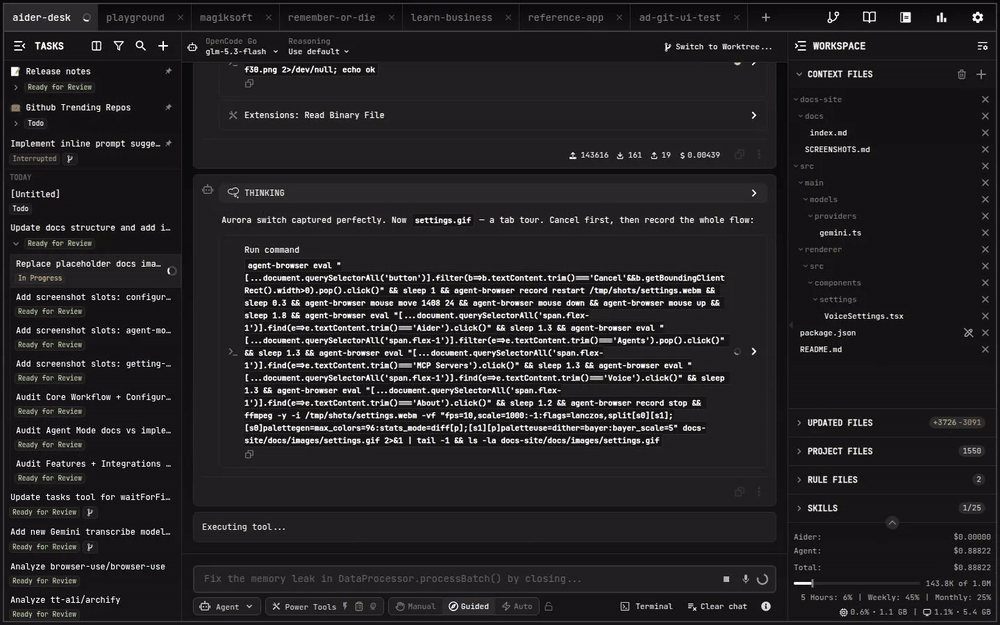

# Settings Overview

AiderDesk provides a centralized location to manage all your configurations. You can access it by clicking the gear icon in the top-right corner of the application.

The settings are organized into the following tabs:

### General

This tab contains settings related to the user interface and general application behavior.
- **Appearance**: Configure the application's language, zoom level, and theme (Dark/Light).
- **Start Up**: Choose what AiderDesk should do on launch: start with an empty task or load the last used task.
- **Notifications**: Enable or disable system notifications.
- **Prompt Behavior**: Customize autocompletion, command confirmation, and key bindings for the prompt field. See [Prompt Behavior](./prompt-behavior.md) for more details.

Model providers are not configured here — you manage API keys and connection settings for all supported Large Language Model (LLM) providers (OpenAI, Anthropic, Gemini, and more) in the **Model Library**, accessible from the top bar. See [Providers](./providers.md).

### Aider

Configure the underlying `aider-chat` engine.
- **Options**: Pass command-line arguments directly to Aider.
- **Environment Variables**: Set environment variables for the Aider process.
- **Context**: Control automatic inclusion of rule files.
For more details, see [Aider Configuration](./aider-configuration.md).

### Agents

Configure the powerful Agent Mode.
- **Agent Profiles**: Create and manage different profiles for the agent, each with its own model, tools, and behaviors.
- **Tool Approvals**: Set permissions for each tool on a per-profile basis.
See [Agent Mode](../agent-mode/agent-mode.md) for more information.

### MCP Servers

Add and manage external tools via [MCP servers](../agent-mode/mcp-servers.md).
- **Global vs. Project Scope**: Use the context switcher to configure servers globally (available to all projects) or per project.
- **File-Based Storage**: Configurations are stored in `mcp-servers.json` files (global: `~/.aider-desk/mcp-servers.json`, project: `<projectDir>/.aider-desk/mcp-servers.json`) and are watched for external changes.
- **Tools & OAuth**: Inspect each server's tools, reload them, and connect OAuth-authorized remote servers.

### Tasks

Configure task-level behavior.
- **Context Compaction**: Set token thresholds and choose the compaction type used when context grows too large. See [Handoff & Compaction](../core/handoff-and-compaction.md).
- **Task Naming & State**: Enable smart task state handling and automatic task-name generation, optionally with dedicated models.
- **Worktrees**: Choose the default working mode, branch prefix, and symlinked folders for [Git Worktrees](../features/git-worktrees.md).

### Memory

Configure the built-in long-term Memory system.
- **Enable/disable Memory**
- **Embedding model selection** and similarity tuning
- **View and delete stored memories**
See [Memory](../agent-mode/memory.md) for details.

### Voice

Configure [voice control](../features/voice-control.md) for dictating prompts.
- **Provider & Model**: Select the provider profile and model used for transcription.
- **Microphone**: Choose your input device and transcription language.
- **System Instructions**: Guide how dictated audio is cleaned up into prompts.

### Hotkeys

Customize keyboard shortcuts for projects, tasks, dialogs (including the Command Palette), and prompt navigation.

### Extensions

Install and manage [extensions](../extensions/index.md).
- **Installing**: Browse available extensions from the registry or install one from a URL (e.g., a GitHub repository).
- **Managing**: Enable, disable, update, or uninstall extensions globally or per project.

### Network

Configure the built-in web server and network connectivity.
- **Server**: Start/stop the HTTP server that powers the [REST API](../integrations/rest-api.md), [Browser API](../integrations/browser-api.md), and remote access. When the server is running, it is accessible on port `24337` (configurable via `AIDER_DESK_PORT`).
- **Basic Auth**: Protect the server with a username and password.
- **Readonly View Mode**: Toggle [Readonly View Mode](../integrations/readonly-view.md) to expose a server-enforced, read-only browser UI. A nested option controls whether extension UI components render in the readonly view.
- **CORS**: Restrict which origins can access the server.
- **Cloudflare Tunnel**: Expose the server securely to the internet via a Cloudflare Tunnel without port forwarding.
- **Proxy**: Configure HTTP/HTTPS proxy settings for outbound requests.

### About

View version information for AiderDesk and the integrated Aider library.
- **Check for Updates**: Manually trigger an update check.
- **Automatic Updates**: Enable or disable automatic downloading of AiderDesk updates.
- **Logs**: Open the directory containing application logs for troubleshooting.
See [Automatic Updates](./automatic-updates.md) for more details.
