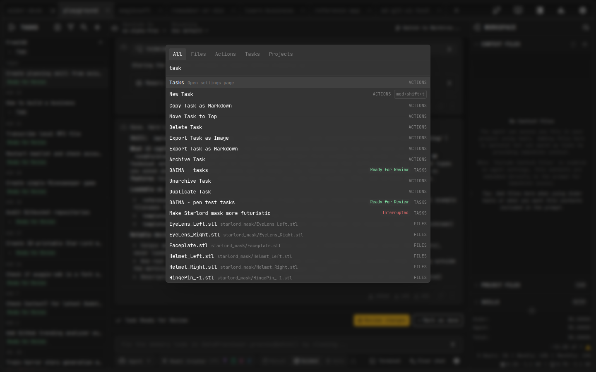

# Command Palette

The Command Palette gives you keyboard-first access to everything in AiderDesk: files, actions, tasks, and projects — searchable with fuzzy matching.

## Opening the Palette

Use the **Command Palette** hotkey — `Ctrl+Shift+P` (macOS: `Cmd+Shift+P`) by default. You can rebind it under **Settings > Hotkeys**.

## What You Can Find

| Tab | Contents |
| --- | --- |
| **All** | Everything below, ranked by relevance and recent usage |
| **Files** | Any file in any open project — jump straight to it |
| **Actions** | App commands like opening the editor, Model Library, Usage Dashboard, or any settings page |
| **Tasks** | Switch between tasks of the active project (archived tasks hidden by default) |
| **Projects** | Jump to another open project |

## Tips

- Results are **fuzzy-matched** — type a few distinctive characters instead of full names
- **Recently used** items float to the top of the list
- Navigate with `↑`/`↓`, confirm with `Enter`, dismiss with `Escape`
