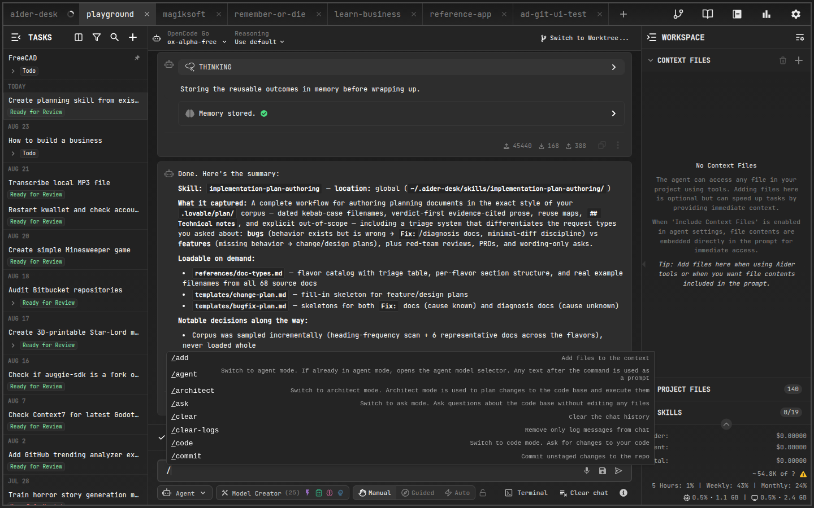

# Commands

AiderDesk supports two kinds of prompt-field commands: **built-in commands** that ship with the app, and **custom commands** you define as Markdown files. Both are triggered by typing `/` followed by the command name, with autocompletion as you type.



## Built-in Commands

### Core

- **`/add`** — adds one or more files to the chat context. *Example*: `/add src/main.js src/utils.js`
- **`/drop`** — removes files from the chat context. *Example*: `/drop src/main.js`
- **`/read-only`** — adds files as read-only reference material. *Example*: `/read-only docs/api.md`
- **`/run`** — executes a shell command and optionally adds the output to the chat. *Example*: `/run ls -l`
- **`/test`** — runs the predefined test command for your project.

### Chat & Context Management

- **`/clear`** — clears chat history and drops all files from context
- **`/clear-logs`** — removes only log messages, keeping the conversation intact
- **`/reset`** — full session reset: drops all files from context and clears the conversation history, keeping the task itself
- **`/compact`** — summarizes the conversation to reduce token usage ([learn more](handoff-and-compaction.md))
- **`/smart-compact`** — applies smart compaction (deterministic trimming of older tool output and reads) without LLM summarization ([learn more](handoff-and-compaction.md#compaction-types))
- **`/copy-context`** — copies the current context as Markdown for pasting into web UIs
- **`/tokens`** — reports current token usage broken down by files, messages, and repo map

### Mode Switching

- **`/agent`** — switches to Agent Mode for autonomous task execution *(default)*
- **`/code`** — switches to Code Mode for direct coding requests
- **`/ask`** — switches to Ask Mode for questions without changes
- **`/architect`** — switches to Architect Mode for planning large-scale changes
- **`/context`** — switches to Context Mode for automatic relevant-file selection

### Model & Aider Control

- **`/model`** — opens the model selector. *Example*: `/model openai/gpt-4.1`
- **`/reasoning-effort`** — sets reasoning effort (`low`, `medium`, `high`)
- **`/think-tokens`** — sets the thinking token budget. *Example*: `/think-tokens 8k`
- **`/undo`** — undoes the last Aider-made git commit
- **`/redo`** — re-runs the last user prompt
- **`/edit-last`** — edit and re-submit your last message

### Utilities

- **`/web`** — scrapes a URL and adds its content to the chat. *Example*: `/web https://aider.chat/docs/`
- **`/map`** — prints the current repository map
- **`/map-refresh`** — forces a repo map refresh
- **`/commit`** — commits unstaged changes
- **`/resolve-conflicts`** — resolves merge conflicts using AI (worktree or main repo)
- **`/init`** — initializes an `AGENTS.md` rule file for your project
- **`/task-info`** — toggles the Task Info panel for the current task
- **`/handoff`** — extracts relevant context into a new focused task ([learn more](handoff-and-compaction.md))

### Subtasks & Subagents

- **`/subtask`** — creates a subtask of the current task. *Example*: `/subtask Write unit tests for the parser module`
- **`/subagent`** — sends your prompt directly to one of your enabled subagent profiles. *Example*: `/subagent code-reviewer Review the latest changes`

## Custom Commands

Custom commands let you automate repetitive workflows. Each command is a Markdown file with YAML front matter; its body becomes the prompt sent to the AI.

### Where to Create Them

1. **Global** — `~/.aider-desk/commands/` — available in all projects
2. **Project-specific** — `.aider-desk/commands/` — only for that project; overrides global commands with the same name

Both directories are created automatically if missing and watched for changes.

### File Format

```markdown
---
description: A brief description shown in autocompletion.
arguments:
  - description: Description for the first argument.
    required: true # optional, defaults to true
includeContext: true # include current chat history & context files
skills: writing-tests # optional, comma-separated skills to activate
autoApprove: false # let the agent execute tools without approval
---
Template sent to the agent. Use {{1}}, {{2}} for arguments,
{{ARGUMENTS}} for all arguments joined by spaces.
Any line starting with ! is executed as a shell command first;
its stdout replaces that line in the assembled prompt.
```

### Usage

Type `/mycommand arg1 "argument with spaces"` in the prompt field. Arguments are substituted into the template, embedded shell commands run first, then the final prompt is dispatched according to the active mode.

### Examples

**Conventional commit message** (`.aider-desk/commands/commit-message.md`):

```markdown
---
description: Generate a conventional commit message based on git diff.
includeContext: false
---
Please generate a conventional commit message based on result of git diff.
Follow the Conventional Commits specification: `<type>: <description>`

!git diff HEAD

Only answer with the commit message, nothing else.
```

**Squash unpushed commits** (`.aider-desk/commands/squash.md`) — uses `includeContext: false` so history doesn't pollute the prompt, and `autoApprove: true` so git commands run without confirmation. See more community examples in the [Extensions Gallery](../extensions/extensions-gallery.md).

Subfolders organize related commands: `.aider-desk/commands/review/uncommitted.md` becomes `/review/uncommitted`.
