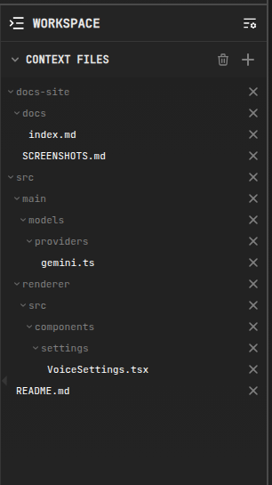
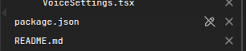

# Context Files

Context files tell the AI exactly which parts of your codebase to focus on. They are shown in the **Context** section of the left sidebar for each task.

## Adding Files

- **Drag & drop** files into the chat area
- **`/add` command**: `/add src/main.js src/utils.js`
- **File browser** in the sidebar — hover a file and click the `+` button to add it; files already in context show a `✕` to remove them
- **Add-file dialog** — click `+` in the Context section header to search and pick files (with an optional *Read-only* flag)
- **IDE connectors** can sync your active editor files automatically — see [IDE Integration](../integrations/ide-integration.md)

## Read-Only Files

Reference files that the AI should read but never modify can be pinned as **read-only**:

- Check the **Read-only** option in the add-file dialog
- Or use the command: `/read-only docs/api.md`

Read-only files are included in prompts as reference material — the agent is instructed not to edit them, giving you a safe way to provide specs, docs, or examples. Files pinned this way are marked with an indicator in the context panel.

## Removing Files

- Click the ✕ next to the file in the context panel (or next to it in the project tree)
- Use the trash icon in the Context section header to drop all files at once
- Or use `/drop src/main.js`

## Tips

- Use `/tokens` to see how much context the current selection consumes
- Set a default context file limit and auto-exclude patterns (e.g. `node_modules/`) in [Settings](../configuration/settings.md)
- Aider's repo map lets the model discover related files even when they are not explicitly added
