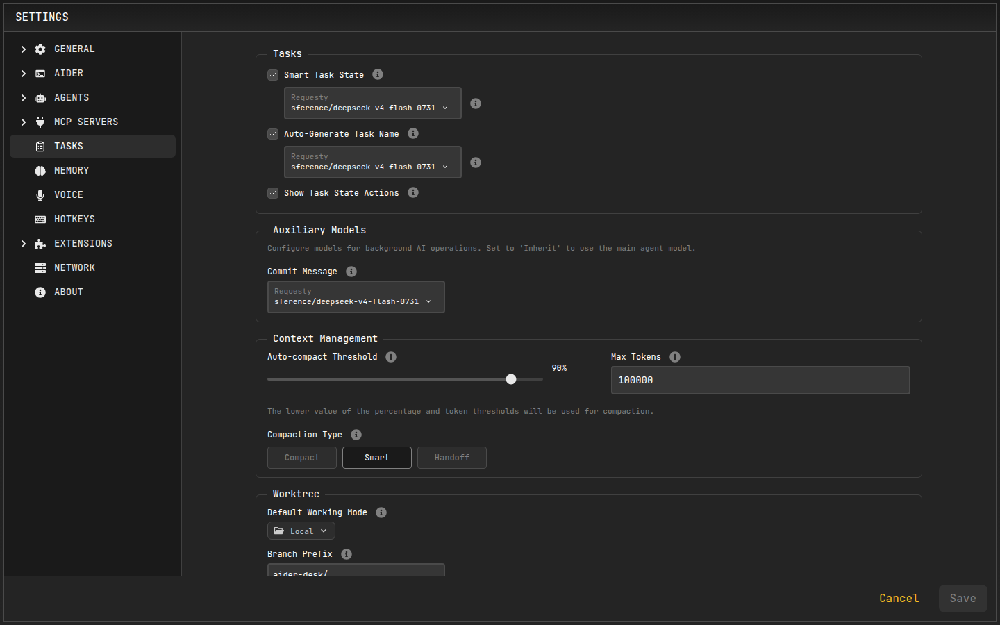

# Handoff & Compaction

Long conversations degrade results: the context window fills up, token costs grow, and the model starts losing track of earlier details. AiderDesk provides three strategies for keeping conversations effective — plus **automatic compaction** that applies them without you noticing.

## Compaction Types

AiderDesk offers three compaction types, configurable globally in task settings and overridable per agent profile:

| Type | What happens | Best for |
| --- | --- | --- |
| **Compact** | Summarizes the entire thread and replaces the conversation history with the summary | Staying in the same task with a clean context |
| **Handoff** | Extracts only the context relevant to a stated goal and creates a **new focused task** | Moving to the next phase with a fresh start |
| **Smart** | Deterministically trims redundant detail from older messages (stale tool outputs, file reads, searches) without using an LLM | Keeping long agent runs lean without altering or summarizing any content |

## Manual Compaction

Run `/compact` in the prompt field to summarize the current conversation. The generated summary captures:

- The primary request and overall intent
- Key technical concepts and decisions
- A chronological list of user messages
- Files read, created, or modified (with relevant snippets)
- Errors encountered and their resolutions
- Current work and the logical next step

You can guide the summary: `/compact Summarize only the code changes.`

The original messages are replaced by the summary once generation completes. In Agent Mode a dedicated `compact` agent profile performs the summarization; in other modes aider's main model is used.

For a non-AI alternative, `/smart-compact` applies [smart compaction](#compaction-types) to the current conversation on demand.

## Handoff to a New Task

Run `/handoff [focus]` to extract what matters for your next goal into a brand-new task:

```bash
/handoff implement password reset functionality with email verification
```

1. AiderDesk analyzes the conversation and your focus goal
2. It extracts relevant decisions, progress, and patterns — not everything
3. A **new task** is created with all context files transferred and a draft prompt generated
4. You review and edit the draft before sending

The original conversation stays intact in the parent task, and worktree mode carries over automatically.

**Good focuses** are specific and action-oriented: *"execute phase one of the created plan"*, *"apply this validation pattern to all API endpoints"*. Avoid vague ones like *"continue"* or *"finish the project"*.

:::tip[Chain handoffs for big projects]

```
Main Task: Build E-commerce Platform
  → /handoff Implement product catalog
  → /handoff Add search functionality
  → /handoff Build shopping cart
```

Focused threads consistently produce better agent results than one long, meandering conversation.
:::

## Automatic Compaction

Instead of watching token counts yourself, configure AiderDesk to compact conversations automatically:

1. Open **Settings → Tasks**
2. Set when auto-compaction triggers:
   - **Percentage** of the model's context window
   - **Absolute token count**

   Whichever threshold is reached first takes effect; set the percentage to `0` to disable auto-compaction entirely.
3. Choose the **compaction type** to use (Compact, Handoff, or Smart)

When the threshold is exceeded mid-task, the configured strategy runs automatically and work continues with the condensed context.



Per-profile overrides are available in [Agent Profiles](../agent-mode/agent-profiles.md) — useful when a subagent should always use Smart compaction while interactive tasks stay manual.

## Which One Should I Use?

- Same task, running out of window → **`/compact`**
- Next phase deserves a clean slate → **`/handoff focus`**
- Don't want to think about it → enable **Smart** auto-compaction

## Related

- [Managing Tasks](../agent-mode/managing-tasks.md) — tasks created by handoff
- [Custom Prompts](../advanced/custom-prompts.md) — customize the `handoff.hbs` template
