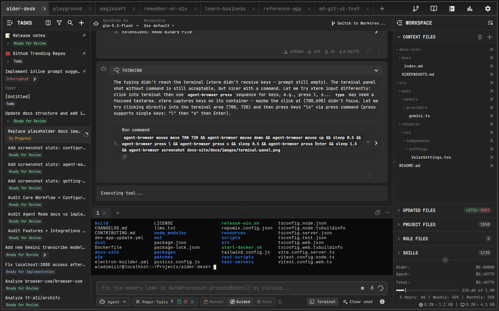
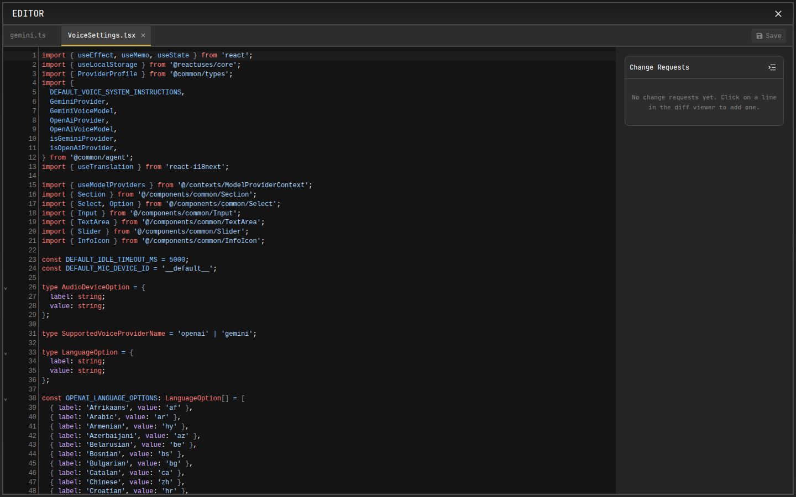

# Terminal & File Editor

AiderDesk ships workspace tools so you can act on AI-generated changes without leaving the app.

## Integrated Terminal

Open the built-in terminal from the task toolbar to run commands inside your task's isolated environment:

- Runs in the **task's working directory** — when using [Git Worktrees](../features/git-worktrees.md), commands execute inside the worktree
- Useful for running tests, linters, or build steps right after the agent finishes
- Toggle visibility from the task control bar

## File Editor

The multi-tab **File Editor** lets you view and edit any file in the project directly:

- Edit files side by side with the conversation
- Open files referenced in chat messages or tool output
- Launch it from the command palette (`Open Editor` action)

:::tip
Combine both: let the agent implement a change, run `npm test` in the integrated terminal, and fine-tune the result in the editor — all within the same task.
:::
