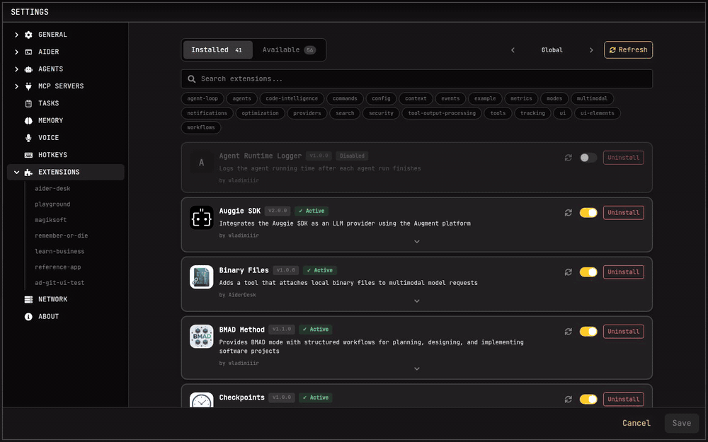

# Extensions

Extensions allow you to extend and customize AiderDesk's functionality. They can add new tools, commands, modes, agent profiles, and react to various events in the application lifecycle.



## What Extensions Can Do

### Register New Capabilities

- **Tools** - Add custom tools that the AI can use (e.g., run linters, execute scripts, query databases)
- **Commands** - Create slash commands like `/generate-tests` or `/deploy`
- **Modes** - Define custom chat modes with specific behaviors
- **Agent Profiles** - Create specialized agents with custom instructions and settings
- **UI Components** - Render custom React components in various locations throughout the interface


### Hook into Events

Extensions can listen to and modify events throughout AiderDesk:

- **Task Events** - Task creation, initialization, updates, and closure
- **Agent Events** - Agent execution start, finish, and step completion
- **Tool Events** - Tool approval, execution, and completion
- **File Events** - Files added to or dropped from context
- **Prompt Events** - Prompt submission and processing
- **Prompt Template Events** - Customize prompt templates before rendering
- **Response Events** - Response chunks and completion
- **And more...**

### Modify Behavior

Many events allow extensions to modify data before it's processed:

- Block dangerous operations (e.g., prevent `rm -rf` commands)
- Transform prompts before sending to the AI
- Filter files being added to context
- Auto-answer approval requests
- Modify AI responses

## Extension Locations

Extensions can be installed at two levels:

| Level | Path | Scope |
|-------|------|-------|
| **Global** | `~/.aider-desk/extensions/` | Available to all projects |
| **Project** | `./.aider-desk/extensions/` | Only for the current project |

Project-level extensions can override global extensions with the same name.

## Hot Reload

Extensions are **automatically reloaded** when changes are detected. There's no need to restart AiderDesk when developing or modifying extensions. Just save your file and the changes take effect within seconds.

## Creating an Extension: Two Paths

**Ask your agent.** AiderDesk ships with a built-in **Extension Creator skill**, so the fastest way to get a custom workflow is to describe it in the chat:

> *"Create an extension that adds a `/standup` command posting my task states to our team channel."*

The agent scaffolds the extension files, implements the tools, commands, or event handlers you asked for, and hot reload picks it up immediately — then you refine it together with your agent in an ordinary task.

**Write it yourself.** Follow the [Creating Extensions](./creating-extensions.md) guide to set up the folder structure and implement the `Extension` interface (`getTools`, `getCommands`, `getModes`, `getAgentProfiles`, event handlers, UI components). The [Event Flow Guide](./event-flow.md) explains how events travel through the app, and the [API Reference](./api-reference.md) documents every hook.

## Getting Started

1. [Browse the Extension Gallery](./extensions-gallery.md) - See what's possible: production-ready extensions and examples
2. [Installation Guide](./installation.md) - Install extensions via CLI or manually
3. Create your own — just ask your agent, or follow the [Creating Extensions](./creating-extensions.md) guide
4. [API Reference](./api-reference.md) - Complete API documentation
5. [Events Reference](./events.md) - All available events and their properties

## Quick Install

The fastest way to install extensions is using the CLI:

```bash
# Interactive installation
npx @aiderdesk/extensions install

# Install specific extension
npx @aiderdesk/extensions install sound-notification --global
```
