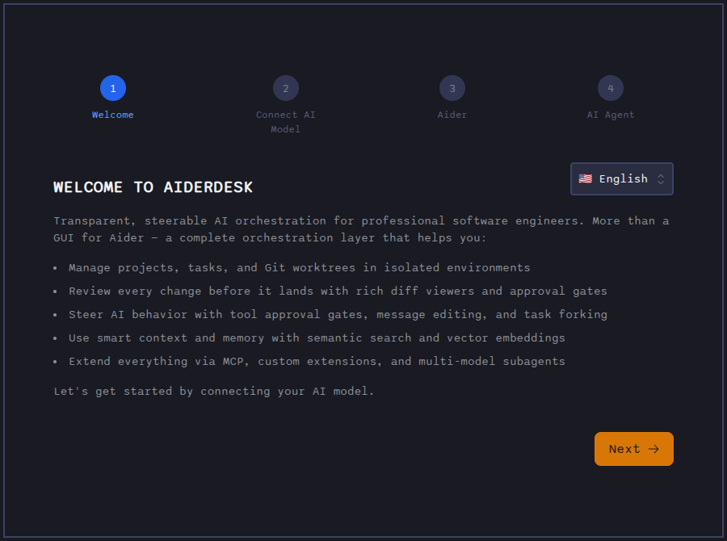
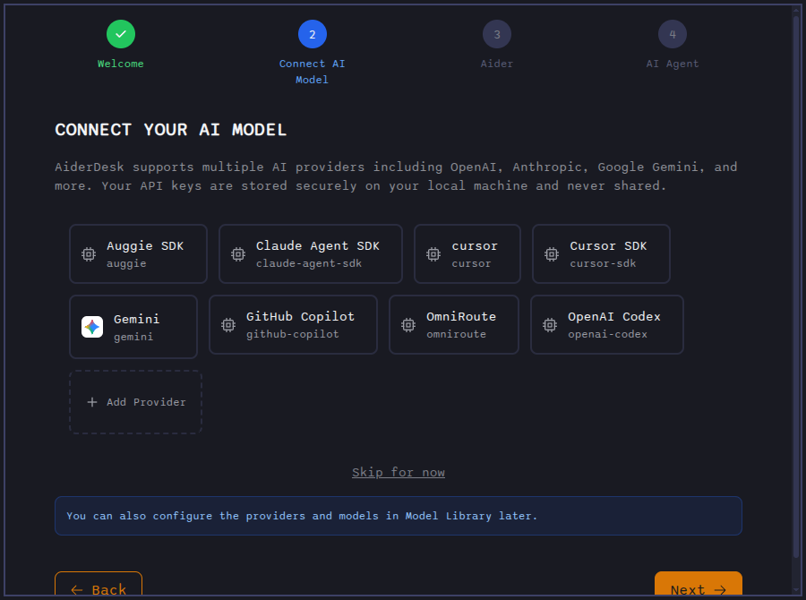

# First Launch

When you start AiderDesk for the first time, an **onboarding wizard** walks you through the essential setup. You can re-run it later by resetting the onboarding flag in your settings.

## Onboarding Wizard

### Step 1: Welcome

The welcome screen introduces AiderDesk's key capabilities and lets you pick your interface language from the selector in the top-right corner (applied immediately).

### Step 2: Connect Model

Choose an AI provider (OpenAI, Anthropic, Gemini, OpenRouter, …) and enter your API key. The connection is verified right away.

Not ready to pick a provider? Use **Skip for now** — you can configure providers any time in the [Model Library](../core/model-library.md) or [Providers Configuration](../configuration/providers.md).

### Step 3: Aider Settings

Fine-tune how aider works: default edit formats, auto-commits, environment variables, and other options. Everything here can be changed later in [Aider Configuration](../configuration/aider-configuration.md).

### Step 4: Agent

A short introduction to Agent Mode — autonomous planning, tool use, and extensibility via MCP. The final **Configure Agent** screen lets you review your agent profiles (or skip straight to finishing).

Clicking **Finish** saves everything, marks onboarding as complete, and opens the main workspace.

## What Happens in the Background

AiderDesk does **not** block you with a long installation phase on startup. The Python environment required by the aider integration is prepared **lazily in the background**, only when it is actually needed:

1. When you send your first message that requires the Python connector, AiderDesk checks for a working `uv` installation (using your system's `uv` if present, otherwise downloading its own copy).
2. It creates the virtual environment and installs the required packages.
3. The aider process starts once the setup finishes — subsequent launches reuse everything already installed.

You can watch the progress (checking dependencies → downloading → creating environment → installing packages) in the app while this one-time setup runs. If it fails, a clear error is shown with a retry option.

Configuration files live in `~/.aider-desk`.

## The Interface at a Glance

- **Left sidebar** — projects, tasks, context files, and updated files
- **Center** — chat interface with prompt field and diff viewer
- **Top bar** — model library, settings, usage dashboard, and project tabs

## Next Steps

- Follow the [Quick Start](quick-start.md) to send your first prompt
- Read about [Managing Projects](managing-projects.md)
