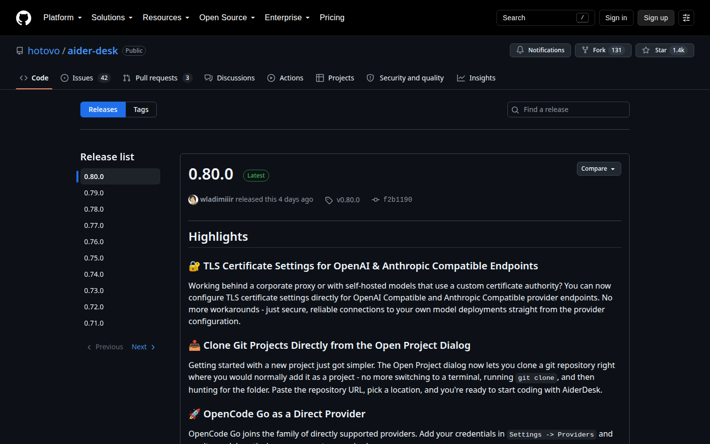

# Installation

## Option 1: Desktop Application

Download the latest version for your operating system from our [Releases page](https://github.com/hotovo/aider-desk/releases):

- **Windows**: Run the `.exe` installer
- **macOS**: Open the `.dmg` and drag AiderDesk to Applications
- **Linux**: Extract the `.AppImage` and make it executable (`chmod +x`)



### Homebrew (macOS)

```bash
brew update
brew install hotovo-aider-desk
```

Updates are handled from within the AiderDesk application itself — the `brew upgrade` command will not update your installation.

To uninstall:

```bash
brew uninstall hotovo-aider-desk
# optionally also remove all user-data:
# brew uninstall --zap hotovo-aider-desk
```

### Scoop (Windows)

```bash
scoop bucket add extras
scoop install extras/aider-desk
```

Updates are handled from within the AiderDesk application itself — the `scoop update` command will not update your installation.

To uninstall:

```bash
scoop uninstall aider-desk
```

## Option 2: npm (Headless / Browser-Based)

Install and run AiderDesk as a global npm package. This runs the AiderDesk backend service only — you access it through your web browser:

```bash
npm install -g @aiderdesk/aiderdesk
aiderdesk
```

Or run directly without installing:

```bash
npx @aiderdesk/aiderdesk
```

Then open `http://localhost:24337` in your browser. See the [npm CLI guide](../advanced/npm-cli.md) for all commands, including readonly server mode.

## Option 3: Docker

Run AiderDesk in a container for server deployments or public dashboards. See the [Docker guide](../advanced/docker.md).

## First Launch

On first start, an onboarding wizard walks you through connecting a model and basic configuration. Python dependencies are set up lazily in the background when first needed — see [First Launch](first-launch.md).
