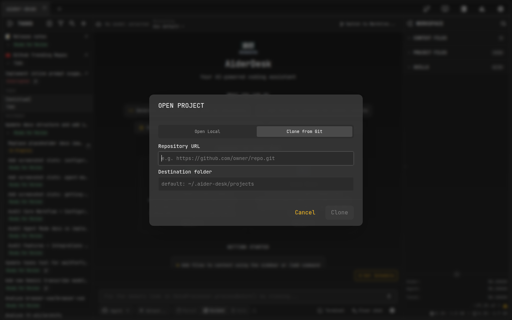
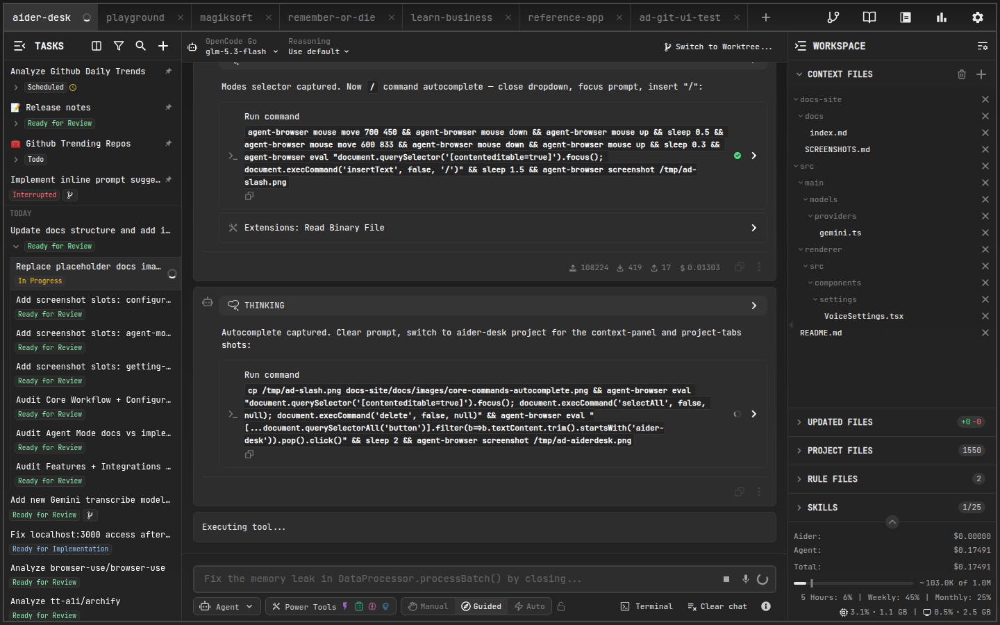

# Managing Projects

AiderDesk is designed to handle multiple projects simultaneously, letting you switch between codebases without losing context.

## Opening a Project

1. If no projects are open, click the **Open Project** button in the center of the screen
2. If you already have projects open, click the **`+`** button in the tab bar
3. In the dialog you can:
   - Type or paste the absolute path to your project's root directory
   - Click the folder icon to browse your file system
   - Select a project from the **Recent projects** list
   - **Clone a Git repository** directly by URL

## Project Isolation

Each open project runs its own isolated environment:

- **Separate contexts** — chat history and context files are fully independent
- **Independent processes** — each project gets its own dedicated Python connector process, started lazily on first use
- **Concurrent work** — an AI task can run in one project while you work in another

## Switching Between Projects

All open projects are displayed as tabs at the top of the window:

- **Click a tab** to switch to that project
- Use **`Ctrl + Tab`** to cycle through open projects

## Closing a Project

Click the **`x`** icon on a tab to close it. The associated process is terminated and the project joins your recent list for quick access later.

## Reordering Tabs

Drag tabs into your preferred position.
