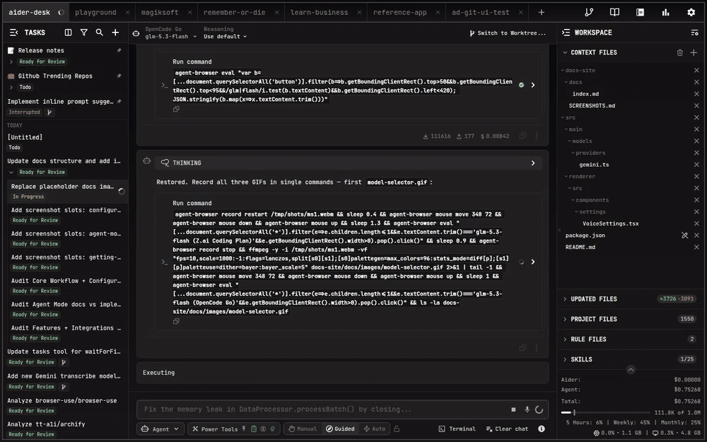
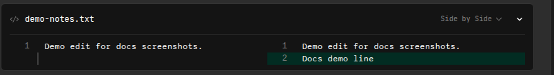

# Quick Start

This guide takes you from an empty workspace to your first accepted code change.

## 1. Open Your First Project

- If no projects are open, click **Open Project**
- Otherwise click the **`+`** button in the tab bar
- Select your project directory — AiderDesk indexes it automatically

## 2. Pick a Model

Open the **Model Selector** in the prompt field area and choose the model for this task. You can change it at any time, even mid-conversation.

## 3. Send Your First Prompt

Type what you want in the prompt field, for example:

- *"Add error handling to the main() function"*
- *"Explain how this authentication module works"*
- *"Refactor this component to TypeScript"*

By default, each task runs in **Agent Mode**: the AI plans the work, uses tools, and shows you exactly what it is doing. Press `Enter` or click Send.

## 4. Review the Changes

Proposed edits appear as diffs in the chat — inspect them line by line, then accept or reject:

Use the checkmark to accept changes (saved to disk) or the X to reject them. See [Reviewing Changes](../core/reviewing-changes.md) for diff modes and approval gates.

## 5. Iterate

Keep refining in the same task, or use [`/handoff`](../core/handoff-and-compaction.md) to spin the next step off into a fresh, focused task.

## Tips

- Add relevant files via the [context panel](../core/context-files.md), or let the IDE connector sync them automatically
- Check the [Built-in Commands](../core/commands.md) — `/compact`, `/commit`, `/test` and more are one keystroke away
