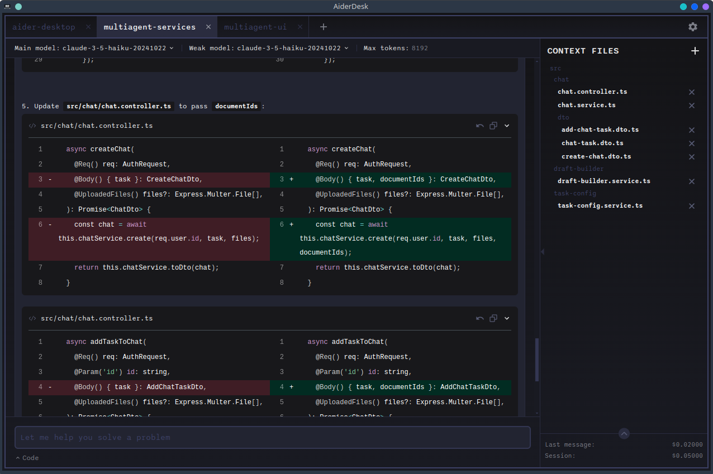

# What is AiderDesk?

AiderDesk is an open-source AI coding platform that combines the power of [aider](https://aider.chat) with an intuitive desktop interface — and grows into a full orchestration layer for AI-assisted development: agentic tasks, review gates, isolated worktrees, and deep extensibility.

## Three Principles

### 🫧 Transparency

See every token, every context file, and every proposed change before it lands. Nothing happens in the dark.

Dig into it via [Reviewing Changes](core/reviewing-changes.md) and [Updated Files](features/updated-files.md).

### 🎛️ Control

The AI is a pair programmer, not an autopilot. Approve tools, authorize destructive actions, fork tasks, and surgically edit chat history to keep things on track.

Steer it with [Agent Mode](agent-mode/agent-mode.md) and its [Agent Profiles](agent-mode/agent-profiles.md).

### 🔌 Extensibility

Adapt AiderDesk to *your* workflow — not the other way around. Register custom tools, commands, modes, agent profiles, UI panels, and lifecycle hooks.

Start with [Extensions](extensions/index.md), the [Extension Gallery](extensions/extensions-gallery.md), or just [ask your agent](extensions/creating-extensions.md) to build one for you.

## Core Concepts

- **[Projects](getting-started/managing-projects.md)** — work on multiple codebases side by side, each fully isolated.
- **[Tasks & Agent Mode](agent-mode/agent-mode.md)** — every conversation lives in a task; an AI agent plans, uses tools, and executes work autonomously (with your approval).
- **[Context Files](core/context-files.md)** — pin exactly what the AI sees, manually or via IDE sync.
- **[Models](core/model-library.md)** — switch between OpenAI, Anthropic, Gemini, Ollama, and 25+ other providers per task.
- **[Extensions](extensions/index.md)** — tailor AiderDesk to *your* workflow: custom tools, commands, modes, agent profiles, UI panels, and lifecycle hooks.

## Extensible by Design

AiderDesk is built around one idea: it should adapt to any workflow, not the other way around. [Extensions](extensions/index.md) are the most powerful way to do that — they can register new agent tools and slash commands, define custom chat modes and agent profiles, render UI panels throughout the interface, and hook into every stage of the task lifecycle (prompt submission, tool calls, file changes, responses) to observe, transform, or block behavior.

You don't have to write them yourself: AiderDesk ships with a built-in **Extension Creator skill**, so you can simply ask your agent — *"create an extension that posts task summaries to Slack"* — and get a working scaffold to iterate on. Community extensions are available in the [Extension Gallery](extensions/extensions-gallery.md).

## Highlights

- **Git Worktrees** — isolate risky work; merge back when ready ([Features](features/git-worktrees.md))
- **Review gates** — rich diff viewer and configurable tool approvals ([Reviewing Changes](core/reviewing-changes.md))
- **Smart compaction** — compact, handoff, or smart-summarize long conversations ([Handoff & Compaction](core/handoff-and-compaction.md))
- **MCP support** — consume MCP servers and expose AiderDesk as one ([MCP Servers](agent-mode/mcp-servers.md))
- **REST API & browser access** — automate and monitor from anywhere ([Integrations](integrations/rest-api.md))

## Where to Next?

1. [Install AiderDesk](getting-started/installation.md)
2. Follow the [Quick Start](getting-started/quick-start.md)
3. Learn how [Agent Mode](agent-mode/agent-mode.md) works under the hood
4. Make it yours: browse the [Extension Gallery](extensions/extensions-gallery.md) or build your own [Extensions](extensions/index.md)
