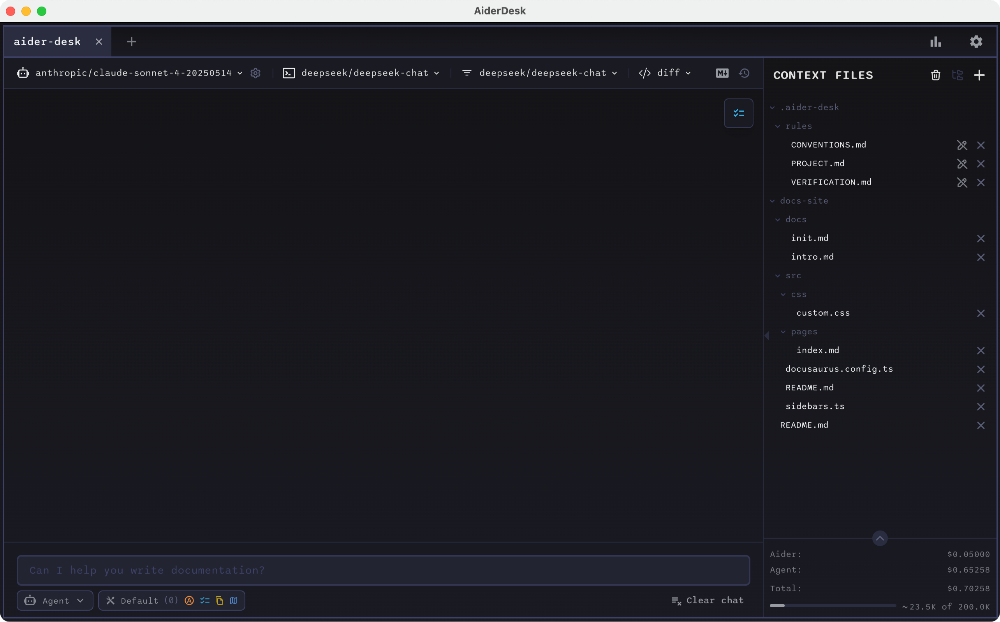

  <h1>Supercharge Your Coding with AI</h1>
  
The most powerful way to integrate AI into your development workflow

## Transform How You Code

AiderDesk brings the power of AI directly into your development environment, making coding faster, smarter, and more enjoyable.

  

## Why Developers Love AiderDesk

  

    <h3>AI-Powered Assistance</h3>
    
Generate, modify, and explain code with natural language prompts

  

  

    <h3>Context-Aware</h3>
    
Understands your entire project for more relevant suggestions

  

  

    <h3>️Lightning Fast</h3>
    
Get AI assistance without leaving your development flow

  

## Perfect For

 **Full-stack developers** looking to accelerate their workflow
 **Teams** wanting consistent, high-quality code
 **Open source maintainers** handling complex projects
 **Learners** who want to understand code better

## Get Started in Seconds

  <a href="https://github.com/hotovo/aider-desk/releases" class="button">Download Now</a>
  
Available for Windows, macOS and Linux

## See It In Action

  

## Connect With Us

Have questions or feedback? Join our growing community!

[GitHub Discussions](https://github.com/hotovo/aider-desk/discussions) |
[Twitter](https://twitter.com/aiderdesk) |
[Discord](https://discord.gg/aiderdesk)
